# CCBlog博客系统

- 项目展示：https://www.luchunzhou.cn
- 账户：用户名：tom，密码：123（更多角色用户将在后续开放）

**一、项目介绍**
 
CCBlog是一个基于springmvc、shiro的多权限博客系统，不同角色的用户可以在该系统下进行博客的发布。
项目主要分为前台和后台两个页面，前台展示博客的信息，后台负责管理博客的信息等。

**二、采用技术**
- SpringMVC；
- MyBatis；
- Shiro安全框架；
- Druid连接池；
- Redis缓存方案；
- Freemarker模板引擎；
- AdminLTE（基于 bootstrap 的轻量级后台模板）；
- Swagger2接口文档；
- 其他。

**三、项目模块**
 
CCBlog系统的具体模块包括：
##### 前台:
- 博客分类；
- 博客归档；
- 博客留言；
- 关于博客；
- 接口文档；
##### 后台:
- 文章管理；
- 分类管理；
- 账户管理；
- 网站管理；
- 关于管理；
- 系统管理。

**四、部署方式**
- 通过git下载源码；
- 创建数据库cc_blog，数据库编码为UTF-8；
- 导入doc/cc_blog.sql文件，默认文件中已包含初始化数据；
- 修改jdbc.properties文件，更新MySQL账号和密码；
- 在CCBlog目录下，执行mvn clean install；
- 启动tomcat；
- 在浏览器访问登录页面：http://127.0.0.1:8080；
- 输入用户名：admin，密码：123登录系统。

**五、其他**
 
如有其他疑问可在下方留言或者访问我的博客进行留言：https://www.luchunzhou.cn

**六、项目展示**
- 博客首页（电脑端）：
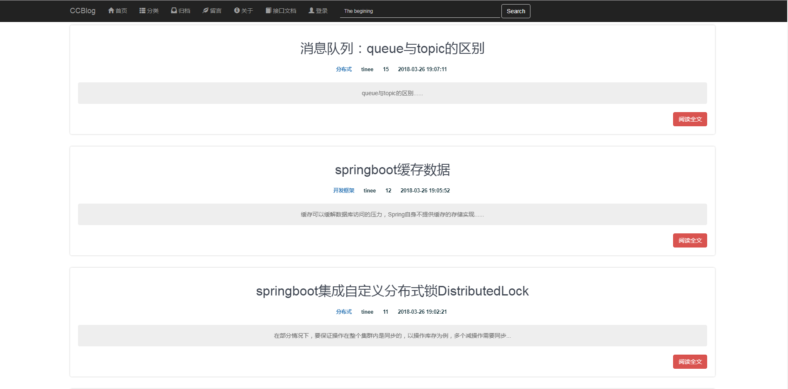
- 博客首页（手机端）：

- 博客详情：
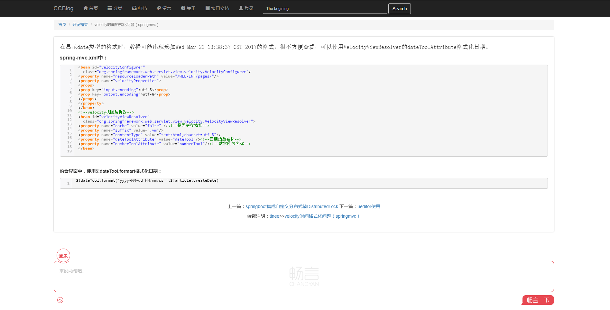
- 博客分类：
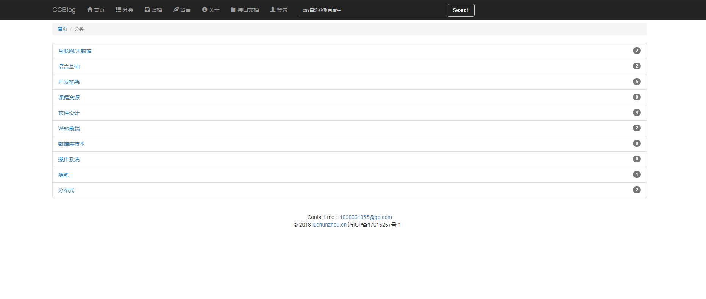
- 博客归档：
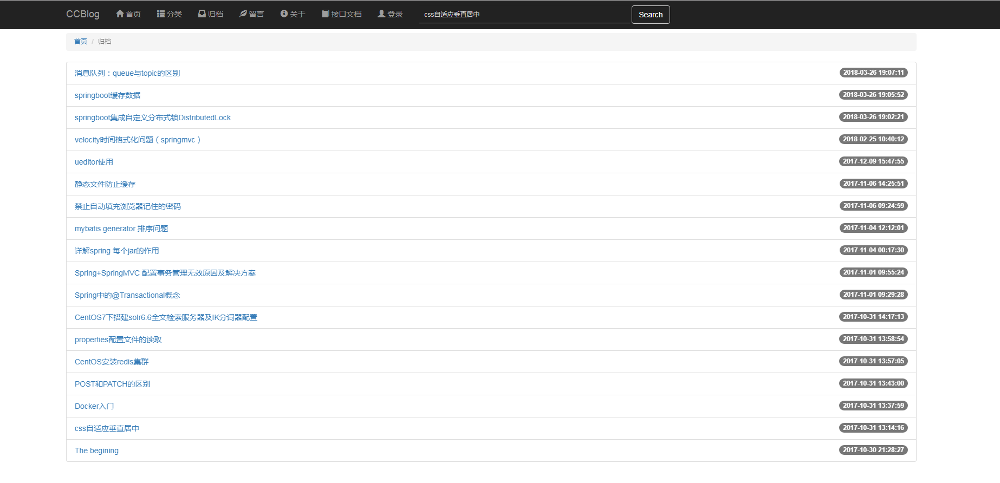
- 博客留言：
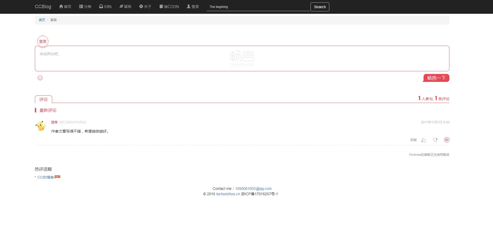
- 接口文档：
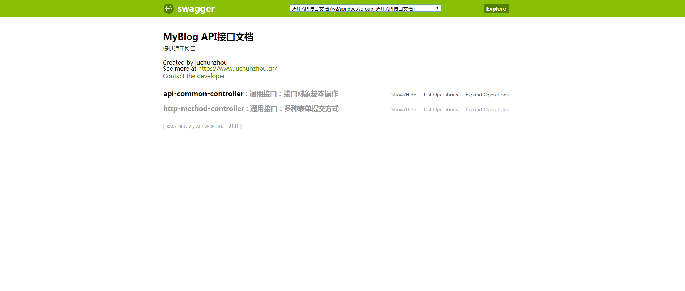
- 后台页面：
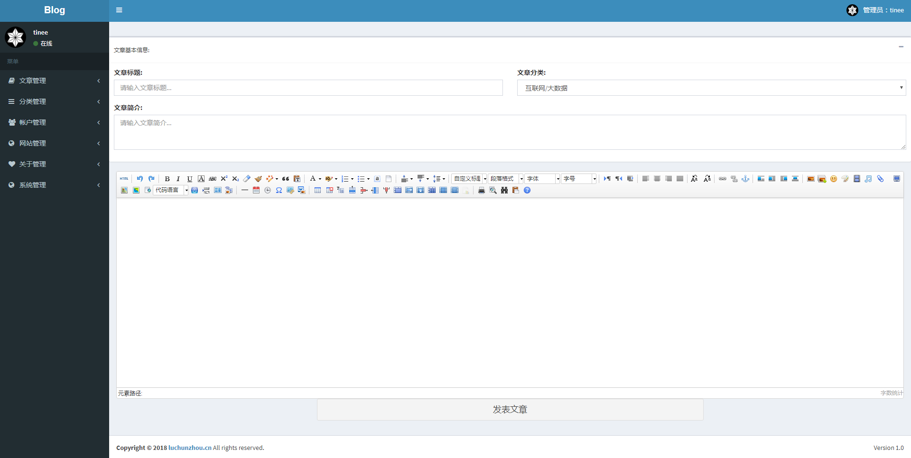
- 文章管理：
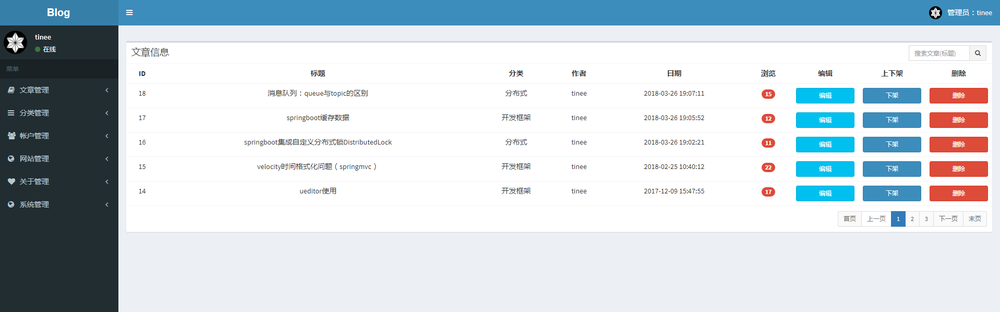
- 分类管理：
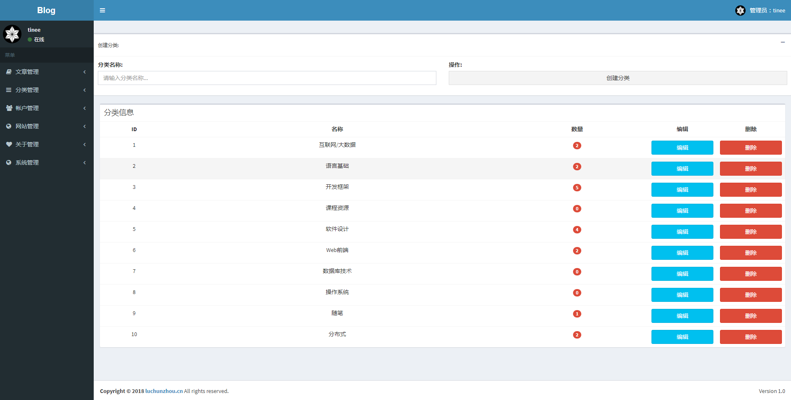
- 账户管理：
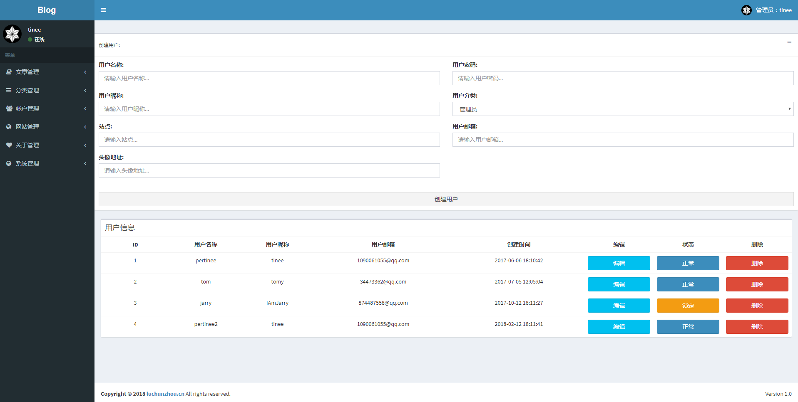
- 网站管理：
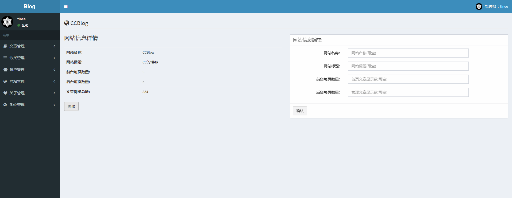
- 关于管理：
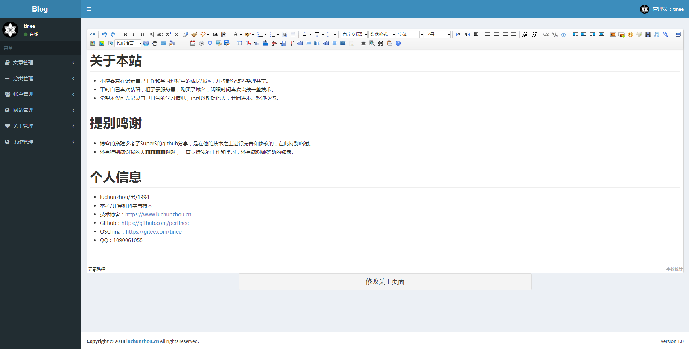
- 日志查看：
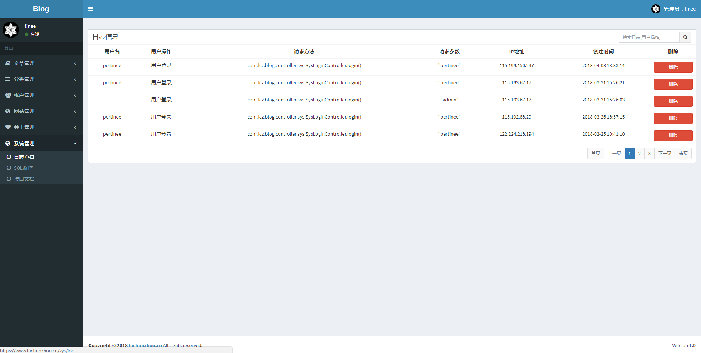
- SQL监控：
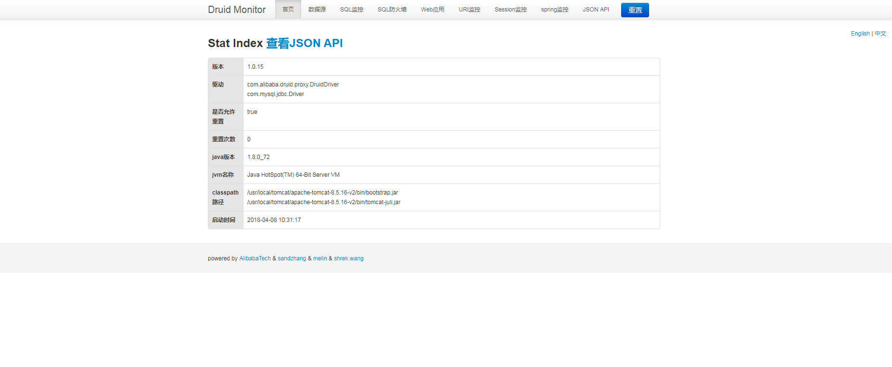